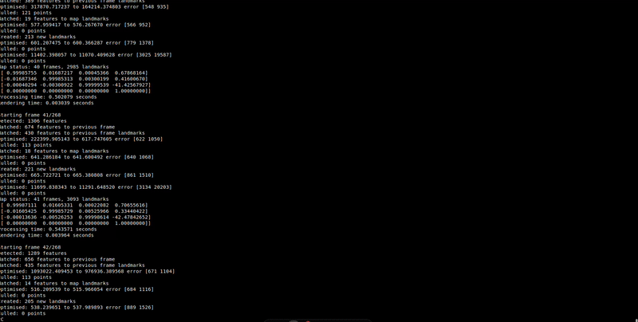
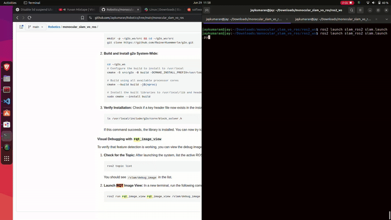
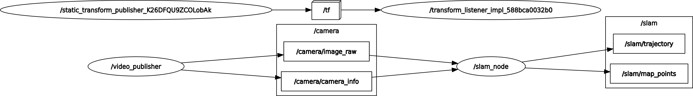
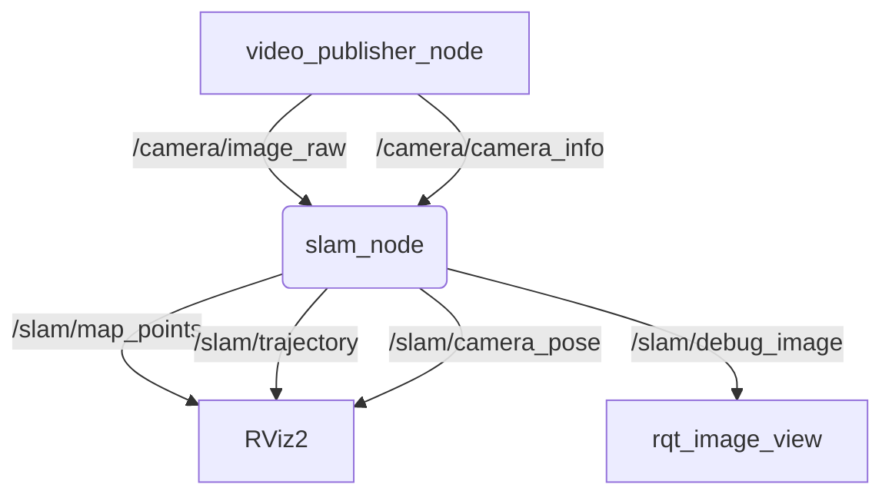

<h1 align="center">ROS2 Monocular Visual SLAM</h1>

### Problem Statement

This ROS2 package (`slam_ros2`) implements a feature-based monocular Visual SLAM (Simultaneous Localization and Mapping) system. The project processes a simulated camera feed from a video file, reconstructs the camera's trajectory, and builds a 3D map of the environment. The core SLAM logic is self-contained and communicates with the ROS2 ecosystem for data input and visualization.

Adapting: [Simple SLAM C++ By gpdaniels](https://github.com/gpdaniels/slam/tree/master)

**Key Features**:

-   [x] **Video Publisher**: A node to publish video frames and camera info, simulating a live camera feed.
-   [x] **Core SLAM Node**: The main node that orchestrates the SLAM process.
-   [x] **Feature Extraction & Matching**: Uses ORB features and a Brute-Force matcher with ratio and symmetry tests.
-   [x] **Pose Estimation & Tracking**: Initializes with `recoverPose` and tracks frame-to-frame.
-   [x] **3D Landmark Triangulation**: Creates new 3D map points from 2D feature matches.
-   [x] **Backend Optimization**: Implements bundle adjustment using g2o to refine camera poses and the 3D map.
-   [x] **Map Maintenance**: Culls unstable or poorly observed landmarks.
-   [x] **Visualization**: Publishes the camera's trajectory, current pose, and the 3D point cloud map for viewing in RViz.
-   [x] **Launch File**: Provides a simple way to start the entire system with a single command.

---

### Demo

After running the launch file, you should see the following in RViz:
1.  A 3D point cloud (`/slam/map_points`) representing the mapped environment.
2.  A green line (`/slam/trajectory`) showing the camera's estimated path.
3.  A set of axes (`TF: /map -> /camera_link`) representing the camera's current position and orientation.







---

### System Architecture (`rqt_graph`)

The system consists of two primary nodes and RViz for visualization.





---

### Project Structure

Your workspace should be set up as follows:

```bash
ros2_ws/
└── src/
    └── slam_ros2/
        ├── CMakeLists.txt
        ├── package.xml
        ├── include/
        │   └── slam_ros2/
        │       ├── slam_processor.hpp
        │       └── types.hpp
        ├── launch/
        │   └── slam.launch.py
        ├── rviz/
        │   └── slam.rviz
        ├── src/
        │   ├── map.cpp
        │   ├── slam_node.cpp
        │   ├── slam_processor.cpp
        │   └── video_publisher_node.cpp
        └── videos/  (You may need to create this folder)
            └── freiburgxyz_525.mp4
```

---

### Setup and Installation

#### 1. System Dependencies
This project requires a ROS2 Humble installation, OpenCV, Eigen, and the g2o library for graph optimization. These dependencies should be listed in `package.xml` using abstract keys like `<depend>g2o</depend>`.

The primary way to install these is with `rosdep`.

```bash
# Navigate to your workspace root
cd ~/ros2_ws

# Update rosdep sources
rosdep update

# Install dependencies for all packages in src
# This may fail if g2o/opencv keys are not in the default lists.
# See the Troubleshooting section if you encounter errors here.
rosdep install -i --from-path src --rosdistro humble -y
```
**If the `rosdep install` command fails, please see the "Troubleshooting" section below.**

#### 2. Workspace Setup
Clone this repository into your ROS2 workspace's `src` directory.

```bash
# Navigate to your ROS2 workspace
cd ~/ros2_ws/src

# Clone the repository (example command)
# git clone <your-repo-url>

# Navigate back to the workspace root
cd ~/ros2_ws
```

#### 3. Build the Package

Build the `slam_ros2` package using `colcon`.

```bash
# Source your ROS2 installation
source /opt/ros/humble/setup.bash

# Build the specific package
colcon build --packages-select slam_ros2

# Source the local workspace to make the nodes available
source install/setup.bash
```

---

### How to Run

Before running, ensure you have a video file. The launch file is pre-configured for `videos/freiburgxyz_525.mp4` inside the package directory.

#### 1. Using the ROS2 Launch File (Recommended)
This is the simplest way to start the entire SLAM system. It launches the video publisher, the SLAM node, and RViz with the correct configuration.

```bash
# Make sure you have sourced your workspace: source install/setup.bash
ros2 launch slam_ros2 slam.launch.py
```

---

### Troubleshooting & Advanced Setup

This section covers common issues related to system dependencies like `g2o` and `opencv`.

#### Issue 1: `rosdep` Fails to Find `g2o` or `opencv`

**Problem:** You run `rosdep install ...` and get an error like `ERROR: the following rosdeps failed to install... cannot find key 'g2o'`.

**Reason:** `rosdep` works by mapping abstract keys (like `g2o`) to platform-specific package names (like `ros-humble-libg2o`). Sometimes, these keys are not in the default `rosdep` lists. We can fix this by providing our own mapping file.

**Solution:**

1.  **Create a Custom `rosdep` Definition File:**
    Create a YAML file in your home directory (or another permanent location) to define the missing keys.

    ```bash
    nano ~/custom_rosdep.yaml
    ```

2.  **Add the Mappings:**
    Paste the following content into the file. This tells `rosdep` that the key `g2o` should be installed as `ros-humble-libg2o` on Ubuntu, and `opencv` as `libopencv-dev`.

    ```yaml
    # Custom rosdep definitions
    g2o:
      ubuntu: [ros-humble-libg2o]

    opencv:
      ubuntu: [libopencv-dev]
    ```
    Save and exit (`Ctrl+X`, `Y`, `Enter`).

3.  **Point `rosdep` to your Custom File:**
    You need to tell your shell session where to find this new file by setting an environment variable. You can add this to your `.bashrc` for persistence.

    ```bash
    export ROSDEP_SOURCES_PATH=$HOME/custom_rosdep.yaml
    echo 'export ROSDEP_SOURCES_PATH=$HOME/custom_rosdep.yaml' >> ~/.bashrc
    ```
    **Important:** Open a new terminal or source your `.bashrc` (`source ~/.bashrc`) for this change to take effect.

4.  **Update and Run `rosdep install` Again:**
    Now that `rosdep` knows about your custom definitions, it can resolve the dependencies correctly.

    ```bash
    cd ~/ros2_ws/
    rosdep update
    rosdep install -i --from-path src --rosdistro humble -y
    ```
    This should now succeed.

#### Issue 2: Manual g2o Installation (Fallback)

**Problem:** The `ros-humble-libg2o` package is not available, or you face compilation errors like `g2o/core/block_solver.h: No such file or directory` even after installing it.

**Reason:** This indicates that the g2o library was not installed to a standard location that CMake can find. A manual build from source will ensure it is installed correctly.

**Solution:**

1.  **Create a Workspace and Clone g2o:**

    ```bash
    mkdir -p ~/g2o_ws/src && cd ~/g2o_ws/src
    git clone https://github.com/RainerKuemmerle/g2o.git
    ```

2.  **Build and Install g2o System-Wide:**

    ```bash
    cd ~/g2o_ws
    # Configure the build to install to /usr/local
    cmake -S src/g2o -B build -DCMAKE_INSTALL_PREFIX=/usr/local -DG2O_BUILD_APPS=OFF -DG2O_BUILD_EXAMPLES=OFF

    # Build using all available processor cores
    cmake --build build -j$(nproc)

    # Install the built libraries to /usr/local/lib and headers to /usr/local/include
    sudo cmake --install build
    ```

3.  **Verify Installation:**
    Check if a key header file now exists in the installation path.

    ```bash
    ls /usr/local/include/g2o/core/block_solver.h
    ```
    If this command succeeds, the library is installed. You can now try to `colcon build` your ROS2 package again.

#### Visual Debugging with `rqt_image_view`

To verify that feature detection is working, you can view the debug image published by the `slam_node`.

1.  **Check for the Topic:**
    After launching the system, list the active ROS2 topics.

    ```bash
    ros2 topic list
    ```
    You should see `/slam/debug_image` in the list.

2.  **Launch RQT Image View:**
    In a new terminal, run the following command to visualize the image stream with keypoints drawn on it.

    ```bash
    ros2 run rqt_image_view rqt_image_view /slam/debug_image
    ```
