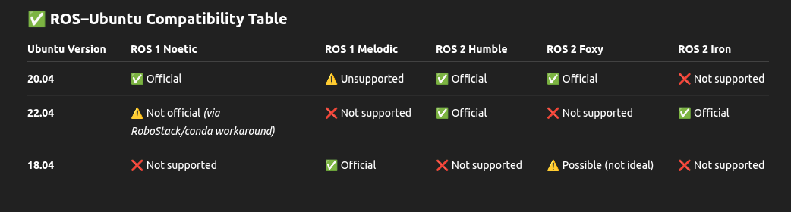

# ROS Noetic on Ubuntu 22.04 with ROS 2 Humble Coexistence

This guide explains how to install **ROS Noetic** using **RoboStack (via Mamba/Conda)** on **Ubuntu 22.04**, while keeping **ROS 2 Humble** installed globally in `/opt/ros/humble`. ROS 2 is the default environment; ROS Noetic is activated via Conda when needed, ensuring clean separation.

Recommended to go through the following repo, if your use case is that, I wanted both ros2 and ros1, so I adapted this:

Original Ref: https://github.com/lesaf92/ros_noetic_ubuntu22 

```bash
# 🔧 Prerequisites
sudo apt-get update
sudo apt-get install htop python3-pip net-tools curl

# 📦 Install Mambaforge (Conda + Mamba)
# Visit https://github.com/conda-forge/miniforge/releases/ for latest versions
curl -L -O "https://github.com/conda-forge/miniforge/releases/download/25.3.0-3/Miniforge3-25.3.0-3-Linux-x86_64.sh"
bash Miniforge3-25.3.0-3-Linux-x86_64.sh

# Restart your terminal, then:

# 🧪 Install ROS Noetic via RoboStack
mamba create -n ros_env python=3.9 -c conda-forge
mamba activate ros_env

conda config --env --add channels conda-forge
conda config --env --add channels robostack-staging
conda config --env --remove channels defaults  # It's okay if this errors

mamba install ros-noetic-desktop-full
mamba install catkin_tools
mamba install rosdep

# 🔁 Initialize rosdep
sudo rosdep init
rosdep update

# 🔒 Prevent ROS 2 Humble Conflicts Inside ros_env
mkdir -p $CONDA_PREFIX/etc/conda/activate.d
nano $CONDA_PREFIX/etc/conda/activate.d/cleanup_ros2.sh

# Paste into the file:
# --------------------
#!/bin/bash
unset ROS_DISTRO
unset ROS_VERSION
unset ROS_PYTHON_VERSION

if [[ "$PYTHONPATH" == *"/opt/ros/humble/"* ]]; then
    export PYTHONPATH=$(echo "$PYTHONPATH" | tr ':' '\n' | grep -v '/opt/ros/humble' | paste -sd ':' -)
fi
# --------------------

chmod +x $CONDA_PREFIX/etc/conda/activate.d/cleanup_ros2.sh

# 🧠 Global ROS 2 Humble Setup in ~/.bashrc
echo "source /opt/ros/humble/setup.bash" >> ~/.bashrc

# 🔁 Aliases to switch environments
echo "alias use_noetic='conda activate ros_env'" >> ~/.bashrc
echo "alias use_ros2='conda deactivate && source /opt/ros/humble/setup.bash'" >> ~/.bashrc

# ✅ Test ROS Noetic (run this in a new terminal)
use_noetic
roscore

# 📦 Install Extra ROS Noetic Packages (inside ros_env)
conda activate ros_env
conda install -c robostack ros-noetic-gmapping
conda install -c robostack ros-noetic-amcl
conda install -c robostack ros-noetic-move-base
conda install -c robostack ros-noetic-map-server
conda install -c robostack ros-noetic-turtlebot3-teleop

# 🛠️ Create Catkin Workspace
mkdir -p ~/catkin_ws/src
cd ~/catkin_ws/src
catkin_init_workspace
cd ~/catkin_ws
catkin_make

echo "source ~/catkin_ws/devel/setup.bash" >> ~/.bashrc
source ~/.bashrc

# 🚀 Use Custom Package (e.g. rmp_2023)
cd ~/catkin_ws/src
git clone <your_repo_url_containing_rmp_2023>

cd ~/catkin_ws
catkin_make

roslaunch rmp_2023 rmp_test.launch

# 🧭 Summary of Usage

# Task                      | Command
# --------------------------|----------------------------------------------
# Use ROS Noetic            | conda activate ros_env
# Use ROS 2 Humble          | use_ros2 (after conda deactivate)
# Build workspace           | cd ~/catkin_ws && catkin_make
# Launch simulation         | roslaunch rmp_2023 rmp_test.launch
# Avoid env conflicts       | Handled automatically in ros_env

# 🐞 Troubleshooting & Common Errors

# ❌ Command 'roscore' not found
# Cause: ROS Noetic not installed or not activated
# Fix: Run conda activate ros_env

# ❌ bash: source: /opt/ros is a directory
# Cause: You tried to source a directory, not a file
# Fix: Use source /opt/ros/humble/setup.bash (only for ROS 2)

# ❌ ImportError: cannot import name 'Log' from 'rosgraph_msgs.msg'
# Cause: ROS Noetic trying to load ROS 2 Humble's Python packages
# Fix: Add cleanup script under $CONDA_PREFIX/etc/conda/activate.d/cleanup_ros2.sh to remove Humble traces

# ❌ ROS_DISTRO was set to 'humble' before
# Cause: ROS 2 was sourced before activating Noetic
# Fix: Always run conda activate ros_env in a clean terminal (with no ROS 2 active)

# ❌ ROS 2 stops working after setting up Noetic
# Cause: You may have removed ROS 2 sourcing from .bashrc
# Fix: Use alias use_ros2 to manually source ROS 2 only when needed

# 📝 Notes

# - Do not source /opt/ros/humble/setup.bash while inside ros_env.
# - Never mix ROS 1 and ROS 2 environments in the same terminal session.
# - Always open a fresh terminal when switching between ROS versions.

```


