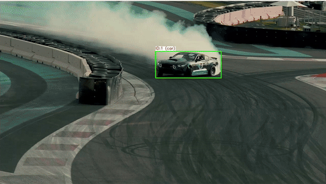
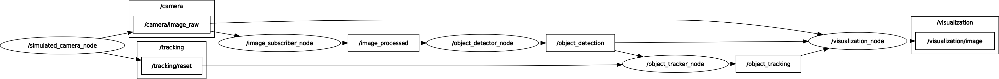
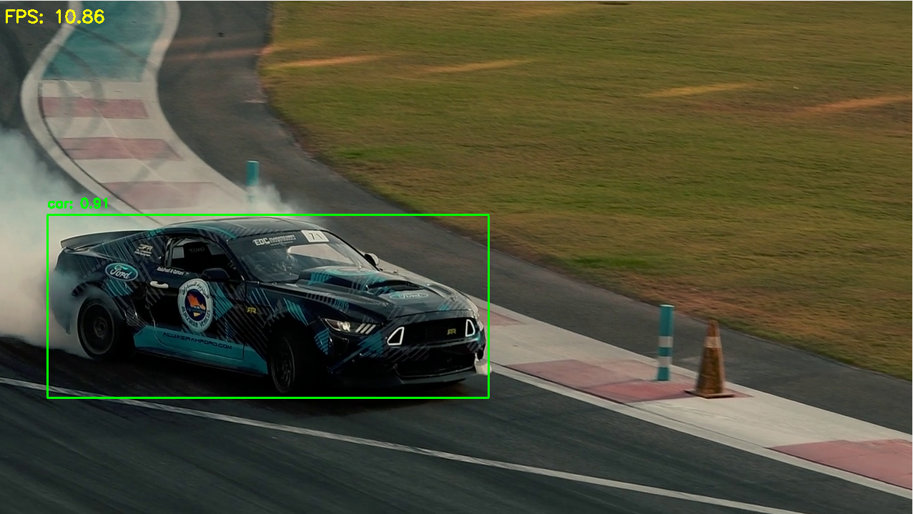
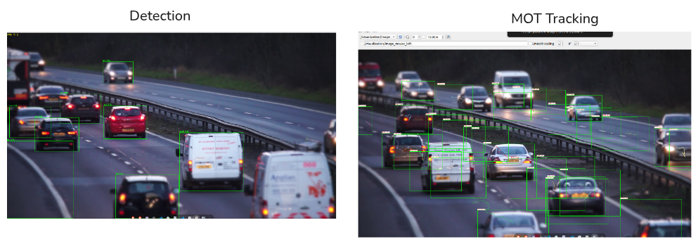

<h1 align="center">ROS Object Tracking Package</h1>

### Problem Statement

A ROS2 Package (`sim_cam_pkg`) which implements object detection and tracking system. It starts with a simulated camera feed from a video file, performs object detection using YOLO11n , then object tracking across frames with OpenCV Kalman filter and finally a visualization node to display results using rqt_image_viewer. 

Additionally, to simulate **continuous** camera feed with a single video file, a simple loop detection logic is included and everytime when the video loops, the tracker IDs are reset back. 

**TASKS**:

- [x]   1: Create a Publisher Node to topic `/camera/image_raw`
- [x]   2: Image Subscriber to topic `/camera/image_raw` Node 
- [x]   3: Object Classiifcation / Detection with YOLO11n 
- [x]   4: Object Tracking with Kalman filter
- [x]   5: Visualization Node
- [x] Launch file
- [x] Clean,commented code
- [x] README Instructions
- [x] Demo Video

---

### Demo



---

**Final Pipeline: `rqt_graph`**



---

### Project Structure

Download the `src` scripts zip provided and place it under `ros_ws/`: [Drive Link](https://drive.google.com/drive/folders/16q2yDCmKLGtdX4Kmhv_bIXON9K96artQ?usp=sharing)

> ```bash
> # Before colcon build
> ros2_ws/
> └── src/
>     └── sim_cam_pkg/
>         ├── CMakeLists.txt
>         ├── package.xml
>         ├── include/
>         │   └── sim_cam_pkg/
>         ├── launch/
>         │   └── object_tracking_pipeline.launch.py
>         ├── models/
>         │   ├── coco.names
>         │   ├── frozen_inference_graph.pb
>         │   ├── ssd_mobilenet_v3_large_coco_2020_01_14.pbtxt
>         │   └── yolo11n.onnx
>         ├── msg/
>         │   ├── Detection.msg
>         │   ├── DetectionArray.msg
>         │   ├── TrackedObject.msg
>         │   ├── TrackedObjectArray.msg
>         │   └── TrackingReset.msg
>         ├── nodes/
>         │   └── object_detector_node.py
>         ├── src/
>         │   ├── image_subscriber_node.cpp
>         │   ├── object_tracker_node.cpp
>         │   ├── simulated_camera_node.cpp
>         │   └── visualization_node.cpp
>         └── videos/
>             └── drift_car.mp4
> ```

---

### Run Instructions:

### DOCKER

```chmod +x docker-entrypoint.sh```

```cd ~/ros2_ws/src/sim_cam_pkg/ ```

```docker build -t ros_tracking:humble .```

> docker run -it --rm \
>     --name full_pipeline \
>     --env="DISPLAY" \
>     --env="QT_X11_NO_MITSHM=1" \
>     --volume="/tmp/.X11-unix:/tmp/.X11-unix:rw" \
>     ros_tracking:humble


1) ***Need to fix docker onnx error.***
2) X11 QT error (in my system)


Build the package from main workspace `ros2_ws`:

```bash
cd ros2_ws
# symlink-install to avoid building for every change in src
# instead of copying to install/share/sim_cam_pkg everytime
colcon build --packages-select sim_cam_pkg --symlink-install
source install/setup.bash

# For clean build, (if any build exists remove)
# rm -rf build/sim_cam_pkg install/sim_cam_pkg log/sim_cam_pkg
```

#### 1. Using ROS Launch File

To simply start all nodes with their default parameters and configs defined,

```bash
ros2 launch sim_cam_pkg object_tracking_pipeline.launch.py
```

#### 2. Run from Multiple Terminals (Manual Node Execution)

Need to `source install/setup.bash` in each new terminal.

**Terminal 1 (Image Publisher)**:

```bash
source install/setup.bash
ros2 run sim_cam_pkg simulated_camera_node --ros-args -p video_path:="drift_car.mp4" -p publish_rate_hz:=30.0
```

**Terminal 2 (Image Subscriber):**

```bash
source install/setup.bash
ros2 run sim_cam_pkg image_subscriber_node
```

**Terminal 3 (detector)**:

```bash
source install/setup.bash
# YOLO expects 640 img_sz
ros2 run sim_cam_pkg object_detector_node.py --ros-args -p confidence_threshold:=0.45
```



**Terminal 4 (tracker):** 

```bash
source install/setup.bash
# Kalman Tracking
ros2 run sim_cam_pkg object_tracker_node 
```

**Terminal 5 (Visualization):**

```bash
source install/setup.bash
# Visualize Overlayed Tracjectory and Detection
ros2 run sim_cam_pkg visualization_node
```

**Terminal 6  (rqt_image_view)  :**

```bash
source install/setup.bash
# rqt
ros2 run rqt_image_view rqt_image_view
```

**Terminal 7  (Detection Topic msg) :**

```bash
source install/setup.bash
# YOLO11n detection
ros2 topic echo object_detection
```

**Terminal 8  (Tracking Topic msg):** 

```bash
source install/setup.bash
# tracker
topic echo /object_tracking
```

---

### Setting up a ROS2 Env

I followed: [docs.ros.org](https://docs.ros.org/en/humble/Installation/Alternatives/Ubuntu-Development-Setup.html) and installed ROS Humble 

**System**: Ubuntu 22.04 , i5 13th gen 

> I've to deactivate miniconda autostart, inorder for my ros_ws to use ros python rather than env python interpreter
>
> ```bash
> conda config --set auto_activate_base false
> # i.e. /opt/ros/humble/lib/python3.10/site-packages:/opt/ros/humble/local/lib/python3.10/dist-packages
> ```

**Create a new `ros_ws` workspace**

```bash
source /opt/ros/humble/setup.bash
mkdir -p ~/ros2_ws/src
cd ~/ros2_ws/src
```

Then , create a package named `sim_cam_pkg` , and build type would be `ament_cmake` as i will be using both ros C++ and py nodes. All the nodes are defined and their communication are handled within a single package. 

**ROS Package Dependencies:** 

- `rclcpp`: ROS2 C++ client library
- `sensor_msgs`: For standard ROS2 message for sensor data (Image)
- `geometry_msgs`: Geometric primitives (Used in tracking  points)
- `cv_bridge`: Convert ROS Image into OpenCV-compatible format
- `message_filters`: To synchronize messages from different types of nodes based on their timestamps (Used in visualization_node, because it will subscribe to `/image_raw`, `/object_detection`, `/object_tracking`)
- `ament_index_cpp`: Required by the C++ nodes to find the share directory of `sim_cam_pkg` (models, video files). 
- `ament_index_python`: Python nodes to find the share directory of  `sim_cam_pkg` (models, video files)
- `rclpy`: ROS2 Python Client Library
- `rosidl_default_generators`:  Build tool required for generating C++ code from custom message definitions (`msg/`)

After installing all these, the `CMakeLists.txt` will be defined with `find_package()`

```bash
# start with a simple node 
ros2 pkg create sim_cam_pkg \
  --build-type ament_cmake \
  --node-name simulated_camera_node \
  --dependencies rclcpp sensor_msgs std_msgs geometry_msgs \
                cv_bridge image_transport message_filters \
                ament_index_cpp ament_index_python \
                rclpy rosidl_default_generators
```

#### System Dependencies

Other than these ros packages dependencies, I will need OpenCV C++ and Python version as system wide package.

```bash
sudo apt update
sudo apt install libopencv-dev python3-opencv python3-numpy
sudo apt install libcurl4-openssl-dev
```

#### Executable Nodes:

1. Image Publisher, Subscriber , Tracking and Visualization Nodes in C++
2. Object Detection node in Python

For every node created , it has to be made executable and its required dependencies should be added in `CMakeLists.txt` . It  is important for the Cmake to compile the source code into runnable program.

Eg: For my `simulated_camera_node` I've added the following snippets in `CMakeLists.txt`

```bash
# Declaring the executable
add_executable(simulated_camera_node src/simulated_camera_node.cpp)
# Compile-time Dependencies for this node
ament_target_dependencies(simulated_camera_node
  rclcpp
  sensor_msgs
  cv_bridge
  image_transport
  ament_index_cpp)

# Link the compiled node against external libraries that this node will be using
target_link_libraries(simulated_camera_node
      # To use the messages generated in the same package 
      ${PROJECT_NAME}__rosidl_typesupport_cpp 
      ${OpenCV_LIBS}
      CURL::libcurl)
      
# Compiled C++ executables to be made discoverable by ros2 run
install(TARGETS
  simulated_camera_node
  image_subscriber_node
  object_tracker_node
  visualization_node
  DESTINATION lib/${PROJECT_NAME}
)
```

Linking target against the [interface](https://docs.ros.org/en/humble/Tutorials/Beginner-Client-Libraries/Custom-ROS2-Interfaces.html) `${PROJECT_NAME}__rosidl_typesupport_cpp` is required when interfaces in the same package are used to directly utilize the custom messages.

The directory structure of nodes will look as follows:

```bash
ros2_ws/
└── src/
    └── sim_cam_pkg/
        ├── CMakeLists.txt
        ├── package.xml
        ├── . . .
        ├── src/
        │   ├── image_subscriber_node.cpp
        │   ├── object_tracker_node.cpp
        │   ├── simulated_camera_node.cpp
        │   └── visualization_node.cpp
        └── nodes/
            └── object_detector_node.py
```

Sanity check whether all dependencies are handled correctly and seems all good here:

`rosdep install -i --from-path src --rosdistro humble -y`

> #All required rosdeps installed successfully

#### ROS msg

Other than standard messages (`sensor_msgs`, `std_msgs`, `geometry_msgs`), I ve used custom messages in Object Detection and  Tracking which helps in structured inter-node communication between `object_detector_node` and `object_tracker_node`.

```bash
mkdir -p src/sim_cam_pkg/msg
touch src/sim_cam_pkg/msg/Detection.msg \
	  src/sim_cam_pkg/msg/DetectionArray.msg \
      src/sim_cam_pkg/msg/TrackedObject.msg \
      src/sim_cam_pkg/msg/TrackedObjectArray.msg \
      src/sim_cam_pkg/msg/TrackingReset.msg 
```

---

#### Launch File

After setting up all the five major nodes and tested them independently via CLI by running in multiple terminals, finally a [launch file](https://docs.ros.org/en/foxy/Tutorials/Intermediate/Launch/Creating-Launch-Files.html) is created, so that I can run and test with a single command. Node Parameters, Configs and descriptions about them are added in this file.

---

### Choices:

- **OpenCV DNN**: For optimized CPU inference

- **YOLO11n**: Nano model:  Got around ~ (10-12 fps) in i5 13th gen CPU with only the ros2 run as active process.

- **Kalman Tracking with OpenCV C++**

#### Object Detection

For detection task, I've used COCO pre-trained `yolo11n.onnx` model with OpenCV DNN Inference. 

```bash
!yolo export model=yolo11n.pt format=onnx # COCO pretrained model
```

Though i could have used SSD pretrained model, i felt integrating ultralytics YOLO would be straightforward to implement for this task and focus more on the tracking and handling ROS communications. The default configurations are :

- NMS Threshold: 0.5
- Input Dimensions: (640, 640)
- Confidence Threshold: 0.45

Additional post processing steps are employed to handle the `raw_ddn_output` and filter the `num_proposals` based on their confidence threshold. So only valid bboxes are retained and are used for tracking in next step.

| Model                        | Params   | FLOPs         |
| ---------------------------- | -------- | ------------- |
| SSD MobileNetV3-Small        | 2.9M     | -             |
| SSDLite320_MobileNetV3-Large | 3.4M     | 0.58 FLOPs(G) |
| **YOLO11n**                  | **2.6M** | 6.5 FLOPs(B)  |
| YOLOv8n                      | 3.2M     | 8.7 FLOPs(B)  |
| YOLOv5nu                     | 2.6M     | 7.7 FLOPs(B)  |

### Tracking

The output results in the visualization node will visualize past 30 centroid points as trajectory and is reconfigurable. By default Track IDs is configured to start from 1 and not 0.

Current track is matched with active tracks using  **Simple Greedy Approach**

---

#### To Do 

- [ ] Make node parameters more configurable from launch file
- [ ] Test OpenCV Inference with OpenVINO IR Inference (Intel) / Build DNN with CUDA
- [ ] Improve Kalman filter logic for MOT, and later try DeepSORT or SORT based tracking.
- [ ] Improve the Logic, Error Handling and focus on CPU Optimizations for realtime performance 

---

### Issues

- For Multi Object Tracking (MOT) of same class, facing visualization errors in Tracking. (i.e. The previous state bbox is still overlayed in the current frame).

  - Checked Object Detection, its all good there

    Attempted to track and associate only the active instances in each frame based on detection, but the visualization logic still requires fixing.

  

---

### Learning Outcome

- [x] Getting familiar with ROS env setup and C++
- [x] Develop individual tasks into a functional pipeline within given time

---

### References

1. https://wiki.ros.org/ROS/Installation
2. https://docs.ros.org/en/humble/Tutorials.html
3. https://docs.ros.org/en/humble/Tutorials/Beginner-Client-Libraries/Creating-Your-First-ROS2-Package.html
4. https://docs.ros.org/en/crystal/Tutorials/Launch-Files/Creating-Launch-Files.html
5. https://github.com/jvirico/kalman-tracker/blob/master/src/kalman.cpp


